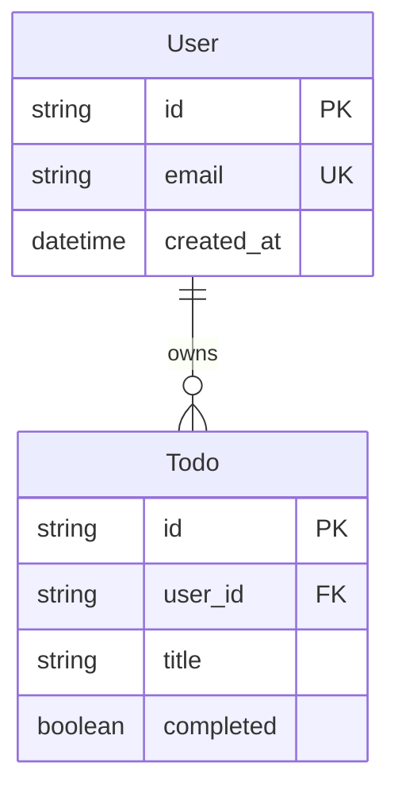

# Data Model: Authentication & User Identity

**Feature**: Authentication & User Identity (Spec 1)
**Date**: 2026-01-14

## User Entity

The User entity represents authenticated users of the Todo application. Better Auth handles credential storage and user lifecycle; the backend requires only the user identifier for authorization decisions.

### User (Better Auth Schema)

Better Auth uses an adapter pattern for persistence. The following TypeScript interface represents the user data stored in the database.

```typescript
interface User {
  /** Primary identifier - UUID string, used in JWT sub claim */
  id: string;

  /** User's email address - used for authentication and display */
  email: string;

  /** Email verification status */
  emailVerified: boolean;

  /** Account creation timestamp */
  createdAt: Date;

  /** Last update timestamp */
  updatedAt: Date;

  /** Optional: hashed password (if using email/password) */
  password?: string;

  /** Optional: user profile data */
  name?: string;
  image?: string;
}
```

### User (SQLModel - Backend)

For backend operations that need to reference users (e.g., denormalized queries, admin operations), the following SQLModel entity may be used. The primary key must match the Better Auth user ID.

```python
from sqlmodel import SQLModel, Field
from datetime import datetime
from typing import Optional

class User(SQLModel, table=True):
    """User entity for backend operations. Primary key matches JWT sub claim."""
    id: str = Field(primary_key=True, max_length=36)
    email: str = Field(unique=True, max_length=255)
    name: Optional[str] = Field(max_length=255, default=None)
    image: Optional[str] = Field(default=None)
    created_at: datetime = Field(default_factory=datetime.utcnow)
    updated_at: datetime = Field(default_factory=datetime.utcnow)
```

## JWT Token

The JWT token represents an authenticated session. Better Auth issues tokens; the backend verifies and decodes them.

### JWT Payload Structure

```json
{
  "sub": "550e8400-e29b-41d4-a716-446655440000",
  "email": "user@example.com",
  "email_verified": true,
  "iss": "https://todo-app.example.com",
  "aud": "https://todo-app.example.com",
  "iat": 1736894400,
  "exp": 1736895300
}
```

### Claim Definitions

| Claim | Type | Required | Description |
|-------|------|----------|-------------|
| `sub` | string | Yes | User ID (UUID) - primary identifier for user isolation |
| `email` | string | No | User's email address |
| `email_verified` | boolean | No | Whether email has been verified |
| `iss` | string | Yes | Issuer identifier (application URL) |
| `aud` | string | Yes | Audience identifier (application URL) |
| `iat` | integer | Yes | Issued at timestamp (seconds since epoch) |
| `exp` | integer | Yes | Expiration timestamp (seconds since epoch) |

### JWT Token (TypeScript - Frontend)

```typescript
interface JWTPayload {
  sub: string;       // User ID
  email?: string;    // User email
  iss: string;       // Issuer
  aud: string;       // Audience
  iat: number;       // Issued at
  exp: number;       // Expiration
}
```

### JWT Token (Python - Backend)

```python
from pydantic import BaseModel
from typing import Optional

class JWTPayload(BaseModel):
    """JWT payload decoded by backend"""
    sub: str                  # User ID
    email: Optional[str] = None
    iss: str                  # Issuer
    aud: str                  # Audience
    iat: int                  # Issued at
    exp: int                  # Expiration
```

## Authenticated User Context

The backend creates an authenticated user context from the verified JWT for use in request handlers.

### AuthenticatedUser (Python)

```python
from pydantic import BaseModel

class AuthenticatedUser(BaseModel):
    """User context extracted from verified JWT"""
    user_id: str              # From JWT sub claim
    email: Optional[str] = None

    class Config:
        frozen = True  # Prevent modification after creation
```

## Validation Rules

| Field | Rule |
|-------|------|
| User.id | Must be a valid UUID string |
| User.email | Must be a valid email format |
| JWT.exp | Must be in the future (not expired) |
| JWT.iss | Must match expected issuer |
| JWT.aud | Must match expected audience |
| JWT signature | Must verify against BETTER_AUTH_SECRET |

## Relationships



- Each User can have zero or more Todos
- Todo.user_id is a foreign key to User.id
- User isolation is enforced by filtering queries by Todo.user_id == authenticated_user.user_id
